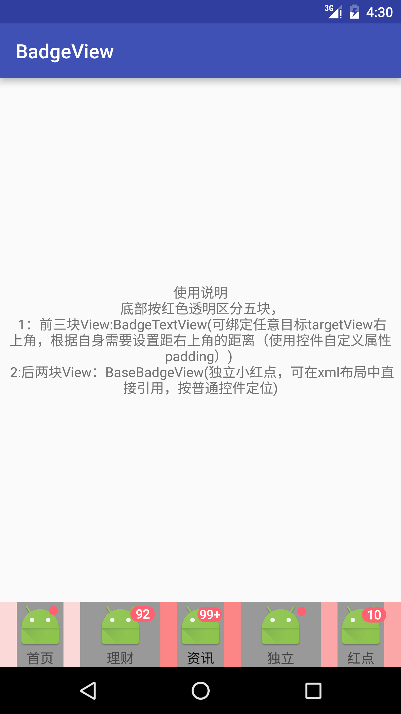

### BadgeView
add badgeview to any targetView in Android
<br>


### Usage

### Step1
Add dependencies in build.gradle.
```
    dependencies {
           compile 'com.itingchunyu.badgeview:badgeview:1.0.5'
    }

```
#### **注释：v1.0.5版本引用名称作如下修改**
1. IBadgeTextView===>BadgeTextView
2. IBadgeViewImpl ===> IBadgeView
3. IBadgeView ===> BadgeViewUtil
5. 以上三个类内部实现不变
### BadgeViewUtil工具类
XML attributes自定义属性（BadgeTextView、BaseBadgeView）可使用
```
<declare-styleable name="BadgeViewUtil">
        <attr name="badge_padding_top" format="dimension" />
        <attr name="badge_padding_right" format="dimension" />
        <attr name="badge_count" format="integer" />
        <attr name="badge_none_show" format="boolean" />
        <attr name="badge_color" format="color" />
    </declare-styleable>
```
### Step2
使用样例
```
    //第一种方式:可依附任意view(无限制:初始定位右上角)
    TextView tv = (TextView) findViewById(R.id.tv);
    BadgeTextView mBadgeView=new BadgeTextView(this);
    mBadgeView.setTargetView(tv);//设置目标targetView(可任意:此处只做演示)
    mBadgeView2.setBadgeCount(92)//数量(0:表示小红点)
            .setmDefaultRightPadding(20)//右依附视图距离
            .setmDefaultTopPadding(20);//上依附视图距离
```
```
    //第二种方式:布局中直接引用(仅作为TextView是用)
    <FrameLayout
        android:layout_width="match_parent"
        android:layout_height="wrap_content"
        android:layout_weight="1"
        android:background="#55ff0000"
        android:gravity="center">

        <!-- 目标View -->
        <TextView
            android:layout_width="wrap_content"
            android:layout_height="wrap_content"
            android:layout_gravity="center"
            android:background="#999"
            android:drawableTop="@mipmap/ic_launcher"
            android:gravity="center"
            android:text="" />

        <!-- 小红点  -->
        <com.itingchunyu.badgeview.BaseBadgeView
            android:id="@+id/btv_null"
            android:layout_width="wrap_content"
            android:layout_height="wrap_content"
            android:layout_gravity="right|top"
            android:layout_marginRight="15dp"
            android:layout_marginTop="5dp"
            android:gravity="center"
            app:badge_count="10"
            app:badge_none_show="true" />

    </FrameLayout>

```
 预知详情使用请参考demo
### 参考实例代码

<https://github.com/stefanjauker/BadgeView>

<https://github.com/wwwrookie/BadgeView>

### License
```
 Copyright 2016 itingchunyu
        
 Licensed under the Apache License, Version 2.0 (the "License");
 you may not use this file except in compliance with the License.
 You may obtain a copy of the License at
         
 <http://www.apache.org/licenses/LICENSE-2.0>
        
 Unless required by applicable law or agreed to in writing, software
 distributed under the License is distributed on an "AS IS" BASIS,
 WITHOUT WARRANTIES OR CONDITIONS OF ANY KIND, either express or implied.
 See the License for the specific language governing permissions and
 limitations under the License.
```
